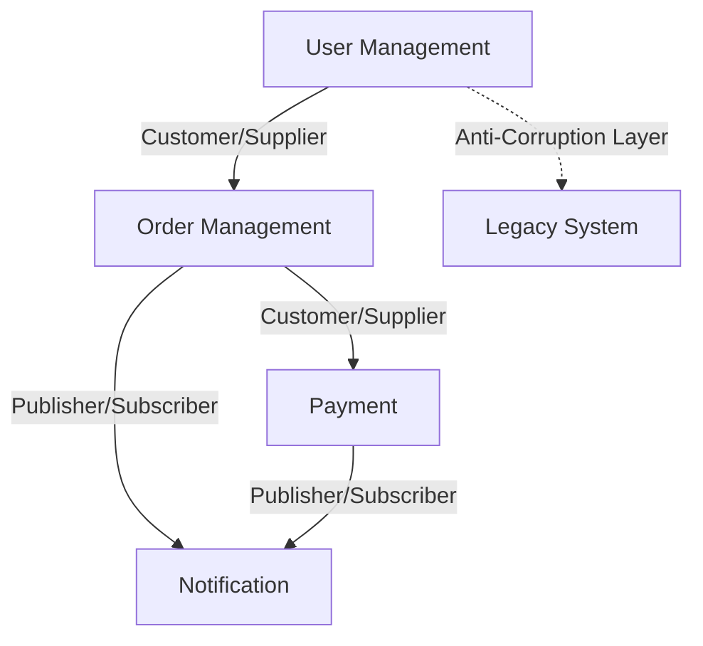

# 🏗️ ドメイン駆動設計（DDD）ガイドライン

<module_info>
このモジュールは、ドメイン駆動設計の実践ガイドラインを定義します。
ビジネスドメインを中心とした設計により、長期的な保守性を実現します。
</module_info>

## 📐 基本規約

### DDDの適用レベル

```yaml
戦略的設計（必須）:
  - 境界づけられたコンテキスト
  - ドメインマップ
  - ユビキタス言語

戦術的設計（段階的）:
  - エンティティ・値オブジェクト
  - アグリゲート
  - ドメインサービス
  - リポジトリパターン
```

### 適用基準

```yaml
DDD採用すべき場合:
  - 複雑なビジネスロジック
  - 長期的な開発プロジェクト
  - ドメインエキスパートとの密な連携

軽量アプローチで十分な場合:
  - CRUD中心のアプリケーション
  - シンプルなビジネスルール
  - 短期間の開発
```

## 🗺️ 戦略的設計

### 境界づけられたコンテキスト

```yaml
コンテキスト分割例:
  User Management:
    責務: ユーザー登録、認証、プロファイル管理
    エンティティ: User, Profile, Role
    
  Order Management:
    責務: 注文処理、在庫管理、配送
    エンティティ: Order, OrderItem, Inventory
    
  Payment:
    責務: 決済処理、請求、返金
    エンティティ: Payment, Transaction, Invoice
    
  Notification:
    責務: 通知配信、テンプレート管理
    エンティティ: Notification, Template, Channel
```

### コンテキストマップ



### ユビキタス言語

```yaml
用語統一例:
  ビジネス用語 → システム用語:
    顧客 → Customer
    注文 → Order
    商品 → Product
    在庫 → Inventory
    
  文脈による使い分け:
    User Management: User（システム利用者）
    Order Management: Customer（購入者）
    
禁止用語:
  - 技術的な実装詳細の用語
  - 曖昧な用語（データ、情報、アイテム等）
```

## 🎯 戦術的設計

### エンティティ設計

```typescript
// ドメインエンティティ
export class Order {
  private constructor(
    private readonly id: OrderId,
    private customerId: CustomerId,
    private items: OrderItem[],
    private status: OrderStatus,
    private createdAt: Date
  ) {}
  
  static create(customerId: CustomerId, items: OrderItem[]): Order {
    // ビジネスルールの検証
    if (items.length === 0) {
      throw new EmptyOrderError();
    }
    
    return new Order(
      OrderId.generate(),
      customerId,
      items,
      OrderStatus.PENDING,
      new Date()
    );
  }
  
  // ビジネスメソッド
  addItem(item: OrderItem): void {
    if (this.status !== OrderStatus.PENDING) {
      throw new OrderNotModifiableError();
    }
    
    this.items.push(item);
  }
  
  confirm(): void {
    if (this.items.length === 0) {
      throw new EmptyOrderError();
    }
    
    this.status = OrderStatus.CONFIRMED;
  }
  
  // ドメインイベント
  getUncommittedEvents(): DomainEvent[] {
    return this.status === OrderStatus.CONFIRMED 
      ? [new OrderConfirmedEvent(this.id)]
      : [];
  }
}
```

### 値オブジェクト

```typescript
// 値オブジェクト
export class OrderId {
  private constructor(private readonly value: string) {
    if (!value || value.trim().length === 0) {
      throw new InvalidOrderIdError();
    }
  }
  
  static generate(): OrderId {
    return new OrderId(crypto.randomUUID());
  }
  
  static fromString(value: string): OrderId {
    return new OrderId(value);
  }
  
  toString(): string {
    return this.value;
  }
  
  equals(other: OrderId): boolean {
    return this.value === other.value;
  }
}

export class Money {
  private constructor(
    private readonly amount: number,
    private readonly currency: Currency
  ) {
    if (amount < 0) {
      throw new NegativeAmountError();
    }
  }
  
  static yen(amount: number): Money {
    return new Money(amount, Currency.JPY);
  }
  
  add(other: Money): Money {
    if (!this.currency.equals(other.currency)) {
      throw new CurrencyMismatchError();
    }
    
    return new Money(this.amount + other.amount, this.currency);
  }
  
  multiply(factor: number): Money {
    return new Money(this.amount * factor, this.currency);
  }
}
```

### アグリゲート設計

```typescript
// アグリゲートルート
export class Order {
  private items: Map<ProductId, OrderItem> = new Map();
  
  addItem(productId: ProductId, quantity: number, unitPrice: Money): void {
    // 不変条件の維持
    if (this.status !== OrderStatus.DRAFT) {
      throw new OrderNotModifiableError();
    }
    
    const existingItem = this.items.get(productId);
    if (existingItem) {
      // 既存アイテムの数量更新
      existingItem.updateQuantity(quantity);
    } else {
      // 新規アイテム追加
      const item = OrderItem.create(productId, quantity, unitPrice);
      this.items.set(productId, item);
    }
    
    // ビジネスルール検証
    this.validateOrderLimits();
  }
  
  private validateOrderLimits(): void {
    const totalAmount = this.calculateTotal();
    if (totalAmount.amount > 1000000) { // 100万円上限
      throw new OrderLimitExceededError();
    }
  }
  
  // アグリゲート外への参照は IDのみ
  getCustomerId(): CustomerId {
    return this.customerId;
  }
}
```

### ドメインサービス

```typescript
// ドメインサービス
export class OrderDomainService {
  constructor(
    private inventoryService: InventoryService,
    private pricingService: PricingService
  ) {}
  
  async validateOrder(order: Order): Promise<void> {
    // 複数のアグリゲートにまたがるビジネスルール
    for (const item of order.getItems()) {
      const available = await this.inventoryService.checkAvailability(
        item.getProductId(),
        item.getQuantity()
      );
      
      if (!available) {
        throw new InsufficientInventoryError();
      }
    }
    
    // 価格整合性チェック
    const currentPrices = await this.pricingService.getCurrentPrices(
      order.getProductIds()
    );
    
    order.validatePrices(currentPrices);
  }
}
```

## 📚 リポジトリパターン

```typescript
// ドメインリポジトリインターフェース
export interface OrderRepository {
  findById(id: OrderId): Promise<Order | null>;
  findByCustomer(customerId: CustomerId): Promise<Order[]>;
  save(order: Order): Promise<void>;
  remove(order: Order): Promise<void>;
}

// インフラストラクチャ実装
export class PostgresOrderRepository implements OrderRepository {
  async findById(id: OrderId): Promise<Order | null> {
    const row = await this.db.query(
      'SELECT * FROM orders WHERE id = $1',
      [id.toString()]
    );
    
    return row ? this.toDomain(row) : null;
  }
  
  async save(order: Order): Promise<void> {
    const data = this.toData(order);
    
    await this.db.transaction(async (trx) => {
      // オーダーの保存
      await trx.query(
        'INSERT INTO orders (id, customer_id, status, created_at) VALUES ($1, $2, $3, $4) ON CONFLICT (id) DO UPDATE SET status = $3',
        [data.id, data.customerId, data.status, data.createdAt]
      );
      
      // アイテムの保存
      await trx.query('DELETE FROM order_items WHERE order_id = $1', [data.id]);
      for (const item of data.items) {
        await trx.query(
          'INSERT INTO order_items (order_id, product_id, quantity, unit_price) VALUES ($1, $2, $3, $4)',
          [data.id, item.productId, item.quantity, item.unitPrice]
        );
      }
    });
  }
}
```

## 🎭 ファクトリーパターン

```typescript
// ドメインファクトリー
export class OrderFactory {
  constructor(
    private inventoryService: InventoryService,
    private pricingService: PricingService
  ) {}
  
  async createFromCart(
    customerId: CustomerId, 
    cartItems: CartItem[]
  ): Promise<Order> {
    // 在庫確認
    await this.validateInventory(cartItems);
    
    // 最新価格取得
    const currentPrices = await this.getCurrentPrices(cartItems);
    
    // 注文アイテム作成
    const orderItems = cartItems.map(cartItem => 
      OrderItem.create(
        cartItem.productId,
        cartItem.quantity,
        currentPrices.get(cartItem.productId)
      )
    );
    
    return Order.create(customerId, orderItems);
  }
}
```

## 📡 ドメインイベント

```typescript
// ドメインイベント
export class OrderConfirmedEvent implements DomainEvent {
  constructor(
    public readonly aggregateId: OrderId,
    public readonly occurredOn: Date = new Date()
  ) {}
  
  eventName(): string {
    return 'OrderConfirmed';
  }
}

// イベントハンドラー
export class OrderConfirmedEventHandler {
  constructor(
    private inventoryService: InventoryService,
    private notificationService: NotificationService
  ) {}
  
  @EventHandler(OrderConfirmedEvent)
  async handle(event: OrderConfirmedEvent): Promise<void> {
    // 在庫引当
    await this.inventoryService.reserveItems(event.aggregateId);
    
    // 確認通知
    await this.notificationService.sendOrderConfirmation(event.aggregateId);
  }
}
```

## 🧪 DDDのテスト

```typescript
describe('Order', () => {
  describe('create', () => {
    it('空の注文は作成できない', () => {
      expect(() => Order.create(customerId, [])).toThrow(EmptyOrderError);
    });
    
    it('有効な注文を作成できる', () => {
      const items = [OrderItem.create(productId, 2, Money.yen(1000))];
      const order = Order.create(customerId, items);
      
      expect(order.getStatus()).toBe(OrderStatus.PENDING);
      expect(order.getItems()).toHaveLength(1);
    });
  });
  
  describe('confirm', () => {
    it('確定後にアイテムを追加できない', () => {
      const order = createValidOrder();
      order.confirm();
      
      expect(() => order.addItem(newItem)).toThrow(OrderNotModifiableError);
    });
  });
});
```

## 📋 実装チェックリスト

```yaml
戦略的設計:
  - [ ] 境界づけられたコンテキストの定義
  - [ ] ユビキタス言語の整備
  - [ ] コンテキストマップの作成

戦術的設計:
  - [ ] アグリゲートの設計
  - [ ] エンティティと値オブジェクトの分離
  - [ ] 不変条件の実装
  - [ ] ドメインイベントの定義

インフラストラクチャ:
  - [ ] リポジトリの実装
  - [ ] ドメインサービスの実装
  - [ ] イベントハンドラーの実装
```