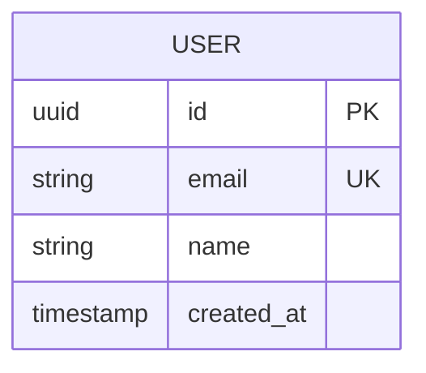

# 📚 ドキュメント駆動開発規約

<module_info>
このモジュールは、ドキュメント駆動開発の実践規約を定義します。
「コードより先にドキュメント」の原則により、明確で保守しやすいシステムを構築します。
</module_info>

## 📐 基本原則

### Documentation First

```yaml
開発順序:
  1. ドキュメント作成（仕様定義）
  2. レビュー・合意形成
  3. 実装開始
  4. ドキュメント更新（実装反映）

利点:
  - 仕様の明確化
  - チーム間の認識統一
  - 実装前の設計検証
  - 保守性の向上
```

### 生きたドキュメント

```yaml
自動同期:
  - コードから自動生成
  - CI/CDパイプラインで更新
  - 実装との乖離防止

継続更新:
  - PR時のドキュメント更新
  - 定期的なレビュー
  - 使用状況の監視
```

## 📋 ドキュメント階層

### 戦略レベル（プロジェクト全体）

```markdown
# プロジェクト概要ドキュメント
## 1. ビジョン・目標
- プロジェクトの目的
- 成功指標
- ステークホルダー

## 2. アーキテクチャ概要
- システム全体図
- 技術スタック選定理由
- 品質属性要件

## 3. 開発方針
- 開発手法
- リリース戦略
- 運用方針
```

### 設計レベル（機能・コンポーネント）

```markdown
# 機能設計書：ユーザー管理
## 1. 機能概要
- 責務と境界
- 主要ユースケース
- 非機能要件

## 2. API仕様
### POST /api/users
```yaml
summary: ユーザー作成
requestBody:
  required: true
  content:
    application/json:
      schema:
        type: object
        properties:
          email:
            type: string
            format: email
          name:
            type: string
            minLength: 1
responses:
  201:
    description: ユーザー作成成功
```

## 3. データモデル

```

### 実装レベル（コード・設定）

```typescript
/**
 * ユーザー管理サービス
 * 
 * @description
 * ユーザーの登録、更新、削除、検索機能を提供する。
 * ビジネスルールの検証と永続化を担当。
 * 
 * @example
 * ```typescript
 * const user = await userService.createUser({
 *   email: 'user@example.com',
 *   name: 'John Doe'
 * });
 * ```
 * 
 * @see {@link UserRepository} データアクセス層
 * @see {@link UserValidator} 検証ロジック
 */
export class UserService {
  /**
   * 新規ユーザーを作成
   * 
   * @param userData - ユーザー情報
   * @returns 作成されたユーザー
   * @throws {ValidationError} 入力値が不正な場合
   * @throws {DuplicateEmailError} メールアドレスが重複している場合
   */
  async createUser(userData: CreateUserRequest): Promise<User> {
    // 実装
  }
}
```

## 🔧 ツールと自動化

### OpenAPI/Swagger活用

```yaml
# openapi.yaml
openapi: 3.0.0
info:
  title: User Management API
  version: 1.0.0
  description: |
    ユーザー管理機能のAPI仕様書
    
    ## 認証
    Bearer Token認証を使用
    
    ## エラーハンドリング
    全エラーは以下の形式で返却：
    ```json
    {
      "error": {
        "code": "ERROR_CODE",
        "message": "エラーメッセージ"
      }
    }
    ```

paths:
  /users:
    post:
      summary: ユーザー作成
      description: |
        新規ユーザーを作成します。
        
        ### ビジネスルール
        - メールアドレスは一意である必要があります
        - 名前は1文字以上必要です
        
        ### 処理フロー
        1. 入力値検証
        2. 重複チェック
        3. ユーザー作成
        4. ウェルカムメール送信
      requestBody:
        required: true
        content:
          application/json:
            schema:
              $ref: '#/components/schemas/CreateUserRequest'
            example:
              email: "user@example.com"
              name: "山田太郎"
      responses:
        '201':
          description: ユーザー作成成功
          content:
            application/json:
              schema:
                $ref: '#/components/schemas/User'
        '400':
          description: 入力値エラー
        '409':
          description: メールアドレス重複

components:
  schemas:
    User:
      type: object
      properties:
        id:
          type: string
          format: uuid
          description: ユーザーID
        email:
          type: string
          format: email
          description: メールアドレス
        name:
          type: string
          description: ユーザー名
        createdAt:
          type: string
          format: date-time
          description: 作成日時
```

### README駆動開発

```markdown
# プロジェクト名

## 概要
このプロジェクトは...

## クイックスタート
```bash
# 環境構築
npm install
cp .env.example .env

# 開発サーバー起動
npm run dev
```

## API使用例
```typescript
// ユーザー作成
const user = await fetch('/api/users', {
  method: 'POST',
  headers: { 'Content-Type': 'application/json' },
  body: JSON.stringify({
    email: 'user@example.com',
    name: '山田太郎'
  })
});
```

## アーキテクチャ
```
src/
├── domain/     # ビジネスロジック
├── application/ # ユースケース
├── infrastructure/ # 外部依存
└── interfaces/ # API・UI
```

## 開発ガイド
- [セットアップ](docs/setup.md)
- [API仕様](docs/api.md)
- [デプロイ](docs/deploy.md)
```

### ADR（Architecture Decision Records）

```markdown
# ADR-001: データベースにPostgreSQLを選択

## 状況
ユーザー情報とトランザクションデータを保存するデータベースを選択する必要がある。

## 決定
PostgreSQLを採用する。

## 理由
- ACID特性によるデータ整合性
- JSONBによる柔軟性
- 豊富な拡張機能
- LLMの知識が豊富

## 結果
- 開発効率の向上
- データ整合性の確保
- 将来の拡張性確保

## 代替案
- MySQL: より軽量だが機能が限定的
- MongoDB: 柔軟性は高いが学習コストが高い

決定日: 2024-01-15
状態: 承認済み
```

## 📖 ドキュメント品質基準

### 必須要素

```yaml
API仕様書:
  - エンドポイント一覧
  - リクエスト・レスポンス例
  - エラーケース
  - 認証方法
  - レート制限

機能仕様書:
  - ビジネスルール
  - 処理フロー
  - 制約条件
  - テストケース

技術仕様書:
  - アーキテクチャ図
  - データモデル
  - 依存関係
  - 設定方法
```

### 品質チェック

```yaml
レビュー観点:
  - 理解しやすさ
  - 完全性
  - 正確性
  - 最新性

自動チェック:
  - リンク切れ
  - スペルチェック
  - フォーマット統一
  - コード例の動作確認
```

## 🔄 ドキュメント更新フロー

### 開発プロセス統合

```yaml
機能開発時:
  1. 機能仕様書作成・レビュー
  2. API仕様書作成・レビュー
  3. 実装開始
  4. テスト
  5. ドキュメント最終更新
  6. リリース

バグ修正時:
  1. 問題の文書化
  2. 修正方針の検討・合意
  3. 修正実装
  4. 関連ドキュメント更新

機能追加時:
  1. 既存仕様への影響調査
  2. 仕様書更新
  3. API仕様書更新
  4. 実装・テスト
```

### バージョン管理

```yaml
ドキュメントバージョニング:
  - セマンティックバージョニング採用
  - 後方互換性の明示
  - 変更履歴の記録
  - 廃止予定の事前告知

変更通知:
  - 重要な変更はアナウンス
  - チーム全体への周知
  - 影響範囲の明示
```

## 📊 ドキュメント成熟度

### レベル定義

```yaml
Level 1（基本）:
  - README.md
  - API仕様書
  - セットアップガイド

Level 2（標準）:
  - アーキテクチャドキュメント
  - 開発ガイド
  - デプロイ手順

Level 3（高度）:
  - ADR（設計判断記録）
  - トラブルシューティングガイド
  - パフォーマンスガイド

Level 4（最適化）:
  - インタラクティブドキュメント
  - 自動生成・検証
  - 使用状況分析
```

### 継続改善

```yaml
定期レビュー:
  - 月次：ドキュメント使用状況分析
  - 四半期：品質評価・改善計画
  - 年次：ツール・プロセス見直し

フィードバック収集:
  - 開発者アンケート
  - ユーザビリティテスト
  - 外部レビュー
```